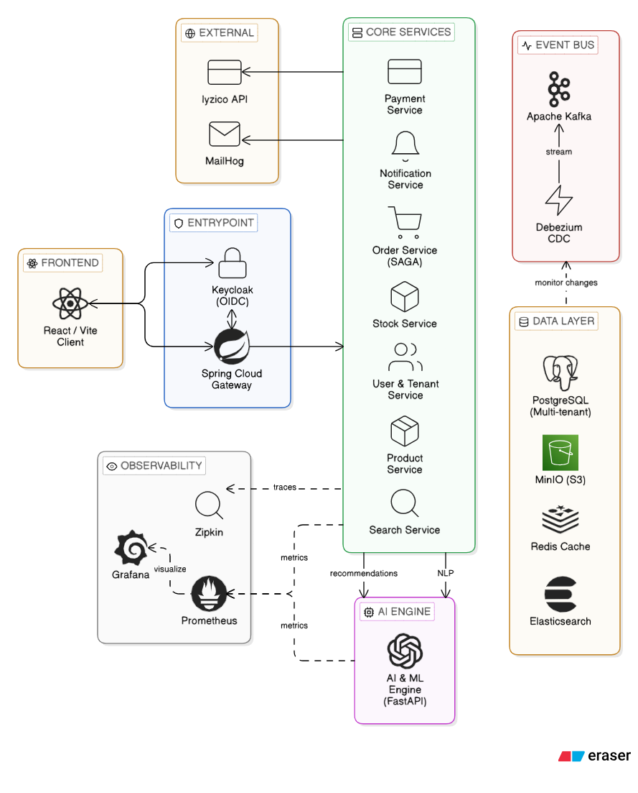
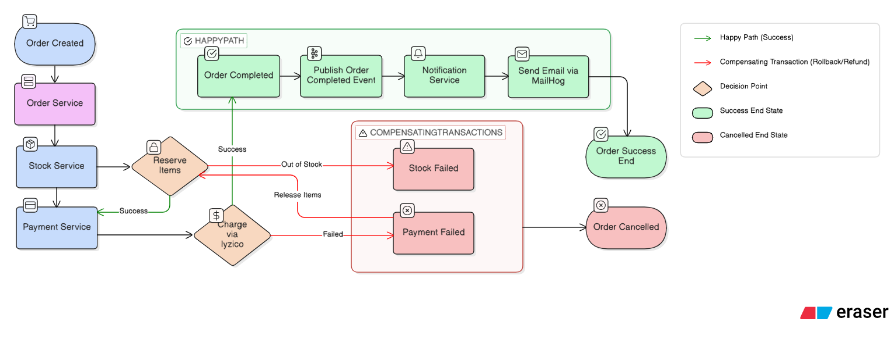

# AI-Powered Multi-Tenant E-Commerce Platform

> A scalable, event-driven, and highly available microservices ecosystem designed for multi-tenant e-commerce operations. An application has been submitted to **TÜBİTAK 2209-A**.

## High-Level Architecture

## Basic Order Flow Diagram

## Key Technical Achievements

This project is not just another CRUD application; it is built to handle production-grade complexities, distributed data integrity, and high concurrency.

* **Event-Driven Architecture (EDA):** Asynchronous inter-service communication powered by **Apache Kafka** to decouple domain contexts.
* **Distributed Transactions & Consistency:** Overcame distributed transaction challenges by implementing the **SAGA Pattern (Orchestration)**.
* **Zero Data Loss (CDC):** Utilized the **Outbox Pattern** integrated with **Debezium** to capture and stream database changes reliably.
* **True Multi-Tenancy:** Engineered a robust **Shared Schema** approach on PostgreSQL to ensure strict data isolation across different merchant tenants.
* **System Resilience & Common Lib:** Established Fault Tolerance in inter-service communication using **Resilience4j**. Modularized cross-cutting concerns (logging, security, error handling) into a centralized **'Common Lib'** to ensure code reusability.
* **Performance & Scalability:** Optimized frequently accessed data using a **Distributed Cache (Redis)** to minimize database latency.
* **Distributed Observability:** Integrated a full observability stack with **Prometheus & Grafana** for system metrics and **Zipkin** for distributed tracing across services.
* **Concurrency Control:** Handled concurrent inventory deductions flawlessly using **Pessimistic Locking** and `Read Committed` isolation strategies.
* **Centralized Identity (OIDC):** Secured the ecosystem with **Keycloak** (OAuth2/OIDC) and automated user-tenant synchronization via a Custom SPI.

## Core Domain Services (Bounded Contexts)

The architecture is meticulously decomposed into highly cohesive domain services to ensure independent scalability and fault isolation:

1. **User & Tenant Service:** The gatekeeper. Manages tenant isolation, RBAC, and seamless identity synchronization with **Keycloak** via Custom SPI.
2. **Product Service:** The primary source of truth. Handles CRUD operations, manages product assets securely via **MinIO**, and leverages **Redis** for high-performance caching.
3. **Search Service (CQRS Focus):** An independent read-optimized service. Consumes events from Kafka (captured by Debezium) to index product data into **Elasticsearch** for blazing-fast, fuzzy search capabilities.
4. **Stock Service:** A high-concurrency service ensuring strict inventory integrity using **Pessimistic Locking**.
5. **Payment Service:** Handles SaaS subscriptions and dynamic payment routing via the **Iyzico API**, abstracting payment logic using the Strategy Design Pattern.
6. **Order Service (SAGA Orchestrator):** The central state machine. Orchestrates the complex distributed transaction lifecycle (Order -> Payment -> Stock) and handles compensating transactions (rollbacks) flawlessly using the **SAGA Pattern**.
7. **Mail & Notification Service:** An event-driven, asynchronous consumer that reacts to domain events (e.g., `PaymentFailed`, `OrderShipped`) and dispatches emails, integrated with **MailHog** for reliable testing.
8. **AI Engine (FastAPI - Planned):** An upcoming isolated ML pipeline designed to provide advanced e-commerce features without blocking main transactional threads. Planned capabilities include NLP-based product review summarization, smart recommendation algorithms, and an LLM-powered virtual assistant.

## Technology Stack

| Category | Technologies |
| :--- | :--- |
| **Backend** | Java (Spring Boot), Python (FastAPI) |
| **Frontend** | React, Vite, Zustand, TanStack Query, react-oidc-context |
| **Database & Cache** | PostgreSQL, **Redis** |
| **Search Engine** | Elasticsearch |
| **Messaging & CDC** | Apache Kafka, Debezium |
| **Object Storage & Mail** | MinIO, MailHog |
| **Security** | Keycloak (OAuth2 / OIDC) |
| **Observability** | **Prometheus, Grafana, Zipkin** |
| **Infrastructure & DevOps** | Docker Compose, Spring Cloud Gateway |

## Getting Started

> **Work In Progress**
> This microservices ecosystem is currently under active development.
>
> Once the core domain services and ML pipelines are fully implemented, this section will provide a streamlined, one-click `docker-compose` setup. You will be able to easily spin up the entire distributed infrastructure (including Kafka, PostgreSQL, Elasticsearch, MinIO, and all microservices) on your local machine. Stay tuned!